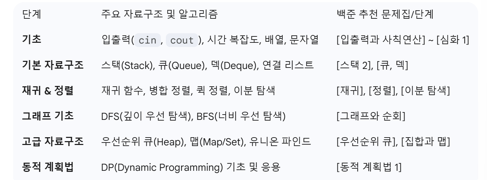

문제풀이를 위한 C++ 

# C++ 주요 특징
1. 객체 지향 프로그래밍 OOP 지원
- 캡슐화, 상속, 다형성 등 객체 지향 개념
- 캡슐화: 변수와 함수를 하나의 단위로 묶는 것
- 상속: 자식 클래스가 부모 클래스의 특성과 기능을 그대로 물려받는 것. 기능 일부 변경할 시 해당 기능만 수정하여 재정의(오버라이딩)
- 다형성: 하나의 변수나 함수가 상황에 따라 다른 의미로 해석될 수 있는 것

**객체 지향 프로그래밍**
- 객체 및 이들간의 관계, 상호작용 등을 기반으로 프로그램을 설계하는 방법론 및 프로그래밍 패러다임의 일종
- 프로그램을 수많은 객체라는 기본 단위로 나누고 이들의 상호작용으로 서술
- 객체란 메소드와 변수를 가지며 특정 역할을 수행하도록 정의한 개념

2. C언어와의 호환성
3. 타입 체크

# 학습 로드맵
자료구조 원리 -> STL 활용법 -> 알고리즘

입출력

- ios_base::sync_with_stdio(false): C의 표준 입출력과 C++ 입출력 싱크를 끊어 속도를 높여줌

- cin.tie(NULL): 입력과 출력 사이의 연결을 끊어 속도를 높여줌

기초

- algorithm 헤더 함수 사용
    - ans = max(ans, cnt);

- 변수 초기화 위치
    - 특정 루프 내에서 사용되는 임시 변수는 루프 안에서 선언하여 변수의 생명 주기를 제한

배열과 문자열

Standard Template Library

## 1. vector
특정 자료형을 여러 개 담을 수 있는 배열을 추상화한 자료구조. 조회/삽입/삭제/무작위접근 가능

동적 배열. 연속된 메모리 공간.

임의 접근 v[i]가 가장 빠르고 끝에 추가/삭제 O(1)로 빠르나, 앞과 중간은 O(N)으로 느림. (앞에 넣으려면 뒤에 있는 데이터를 다 뒤로 밀어야 함)

앞과 끝이 모두 O(1)은 Deque. 얘도 중간은 느림. (양쪽 다 뚫려있는 통로)

앞 중간 끝 모두 O(1)은 List 연결리스트. but 얘는 v[i]가 불가능함

- vector<자료형> 변수명
- vector<자료형> 변수명(숫자): 숫자만큼 벡터 생성 후 0으로 초기화
- vector<vector<자료형>> 변수명: 2차원 벡터

### 메서드
- push_back(): 맨 뒤에 값 추가
- pop_back(): 맨 뒤에 값 제거. 반환값 없음
- clear(): 모든 원소 제거
- v.front(): 첫 번째 원소 반환
- v.back(): 마지막 원소 반환
- .empty(): 벡터 비어있으면 true 반환
- .resize(개수): 벡터 크기 강제 조정. 늘어난 공간은 0으로 채워짐

- algorithm 헤더와 함께 사용 시
    - sort(v.begin(), v.end()): 오름차순 정렬
    - v.begin(): 첫 번째 원소 가리키는 반복자를 반환
    - v.end(): 마지막 원소의 다음을 가리키는 반복자를 반환
## 2. queue

## 3. stack

## 4. deque

## 5. set

## 6. map

