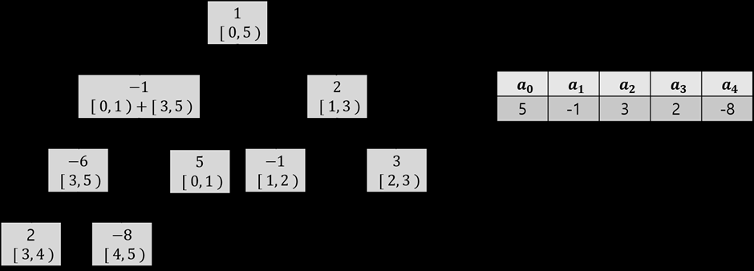

## 세그먼트 트리

point update와 range query를 모두 O(logN)의 시간에 처리할 수 있는 자료구조

- 주로 구간 합, 최솟값, 최댓값 구할 때 사용
- 시간/공간 복잡도가 효율적
- 구현 짧음
- 다양한 변형이 가능


### 기초적 형태

교환법칙이 성립하는 연산에 대한 range query를 처리하는 segment tree

- 예시

5, -1, 3, 2, -8 수열의 구간 합 구하기

1. 완전 탐색

- 특정 인덱스 값 교체 (point update)
    - arr[i] = x 방식, O(1) 

- i번째부터 j번째까지 구간 합 (range query)
    - result += arr[i] 방식으로 모두 더해야 함, O(N)

2. DP 사용

- 미리 O(N^2)개의 구간 합을 계산하고 시작

| $dp_{l,r}$ | $r = 0$ | $r = 1$ | $r = 2$ | $r = 3$ | $r = 4$ | $r = 5$ |
| :--- | :---: | :---: | :---: | :---: | :---: | :---: |
| **$l = 0$** | 0 | 5 | 4 | 7 | 9 | 1 |
| **$l = 1$** | ❌ | 0 | -1 | 2 | 4 | -4 |
| **$l = 2$** | ❌ | ❌ | 0 | 3 | 5 | -3 |
| **$l = 3$** | ❌ | ❌ | ❌ | 0 | 2 | -6 |
| **$l = 4$** | ❌ | ❌ | ❌ | ❌ | 0 | -8 |

- 쿼리를 O(1)에 구할 수 있음
- but 수열 값 하나 바뀐다면 그 값 포함하는 모든 구간 합이 바뀌게 됨. O(N^2)개의 값 갱신
- point update O(N^2)
- range query O(1)


3. 세그먼트 트리

- 구간을 똑똑하게 나눠서 어떤 구간이 주어지든 O(logN)개의 합으로 나타낼 수 있고, 어떤 값이 바뀌어도 같이 변하는 구간은 O(logN)개임

- 아래와 같은 이진트리 형태


- 리프노드가 배열의 실제 수, 부모 노드는 자식 노드의 합(구간합)

```
data = [1,2,3,4,5]
n = len(data)

tree = [0] * (n*4) # 0이 20개

def build(node, start, end):
    # 주어진 배열 idx
    if start == end:
        tree[node] = data[start]
        return


    mid = (start+end) // 2
    build(node*2, start, mid)
    build(node*2+1, mid+1, end)

    tree[node] = tree[node*2] + tree[node*2+1]

# 루트 노드 1번, 0부터 n-1 인덱스까지
build(1, 0, n-1)
print(tree)

# 구간 합
# 구하고자 하는 구간 : start ~ end
# 현재 노드 범위 : left ~ right
def query(node, start, end, left, right):
    if left > end or right < start:
        return 0

    if left <= start and end <= right:
        return tree[node]

    mid = (start+end) // 2
    return query(node*2, start, mid, left, right) + query(node*2+1, mid+1, end, left, right)

# data 배열의 idx번째 수를 val로 변환
# tree에서 해당 node를 포함하는 node를 업데이트
# 리프노드부터 올라오면서 부모노드를 갱신
def update(node, start, end, idx, val):
    if start == end:
        tree[node] = val
        data[idx] = val

    mid = (start+end) // 2
    if idx <= mid:
        update(node*2, start, mid, idx, val)
    else:
        update(node*2+1, mid+1, end, idx, val)

    tree[node] = tree[node*2] + tree[node*2+1]
```
